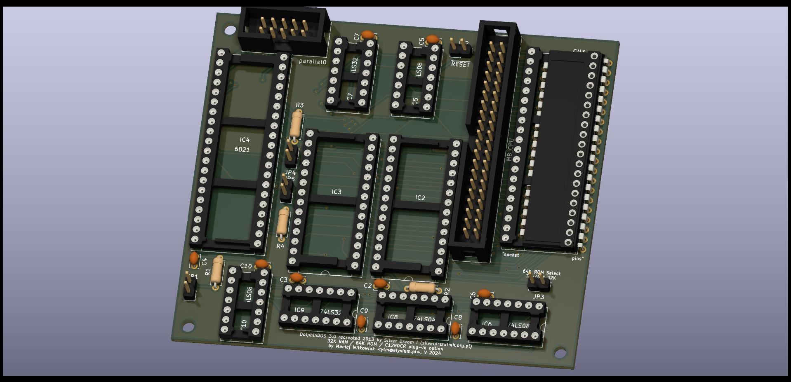
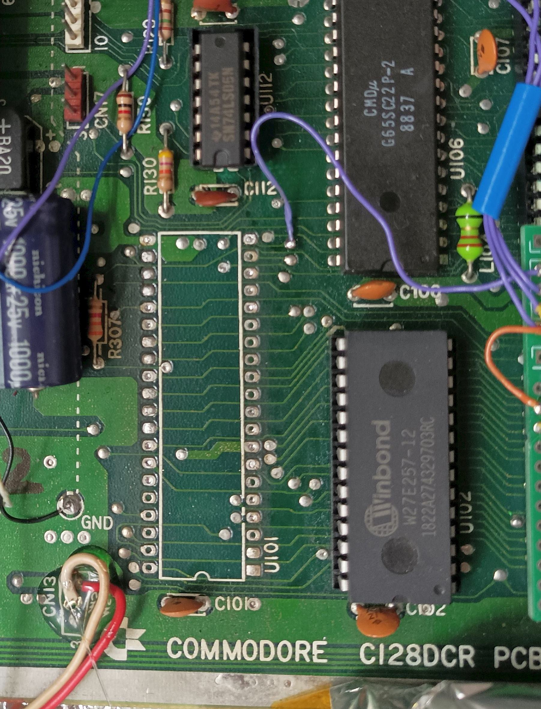
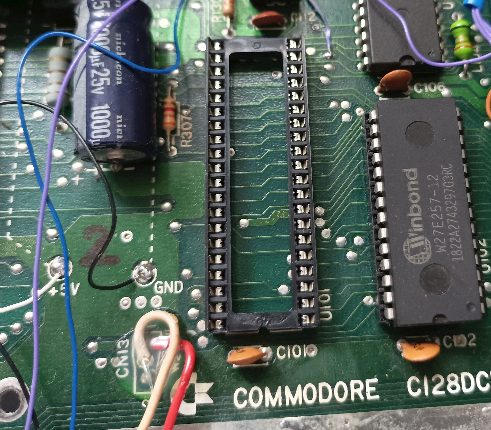
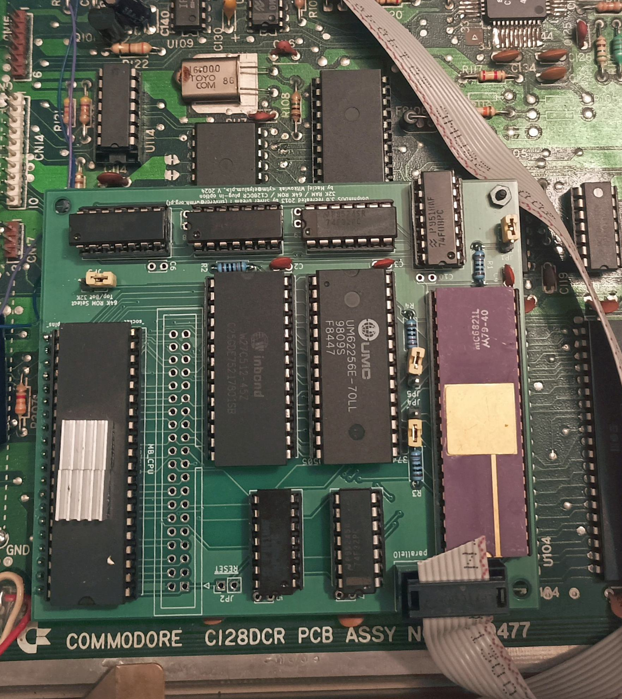
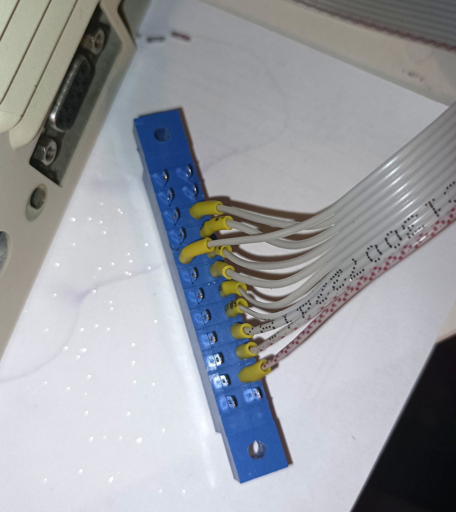
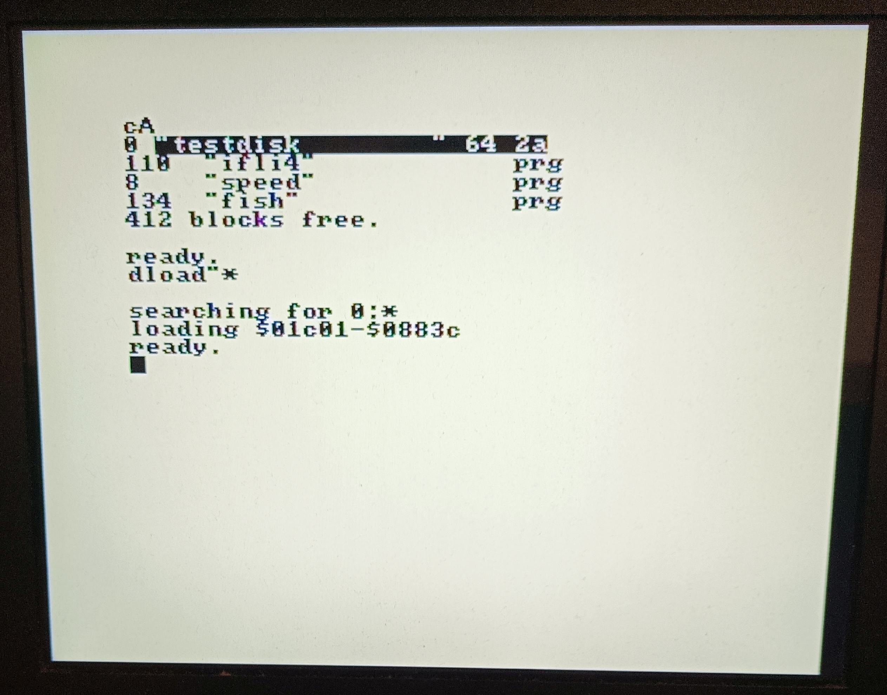
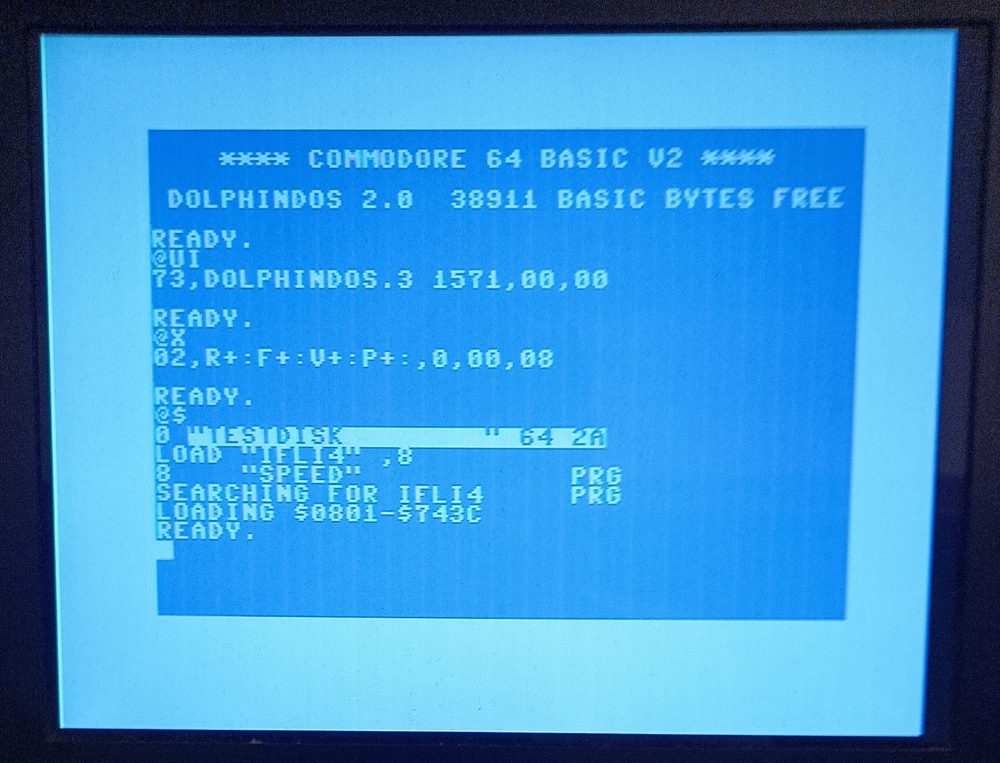
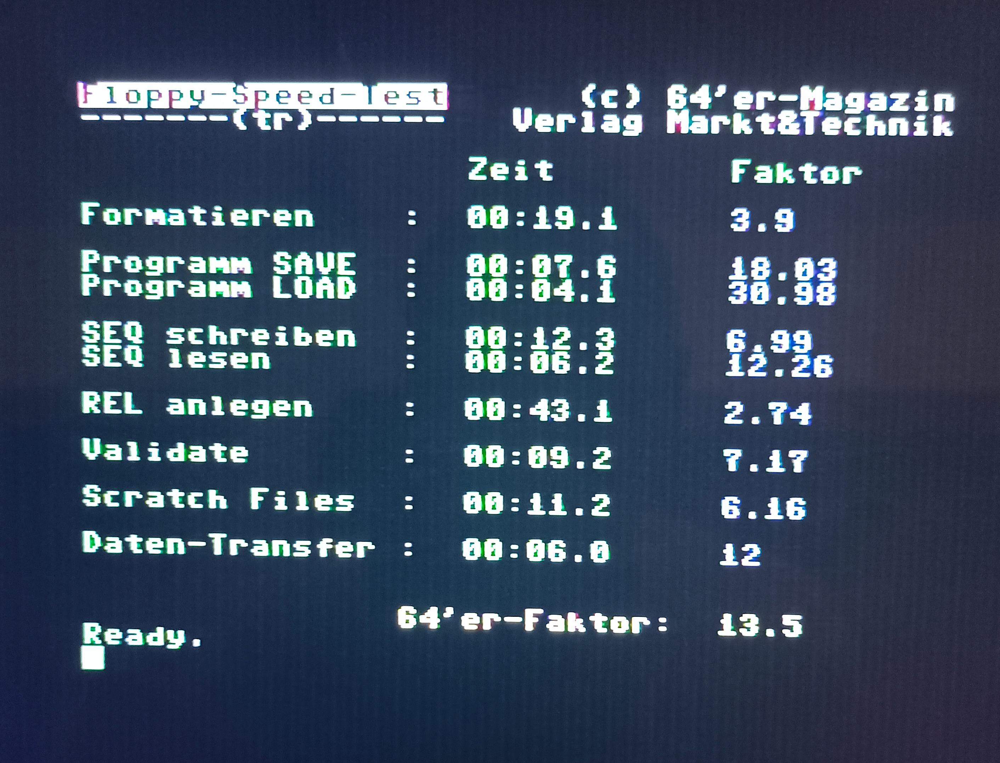

# DolphinDOS 3

This project [recreates work done on DolphinDOS 3 by SilverDream!](https://e4aws.silverdr.com/projects/dolphindos3/) in KiCad with some adjustments for C128DCR. Go there for a lot of information about DolphinDOS.

The goal was to get rid of 40-wire ribbon cable between daughterboard and IDC to IC adapter and plug the board directly into C128DCR mainboard into U101 (6502 CPU) footprint.

With a ribbon cable extension the same board can be still used with 1571 from C128D or standalone 1571 or installed in 1541/1541-II.

# Project

All the Kicad files are in [dolphindos3-kicad/](dolphindos3-kicad/) folder.

Also check [dolphindos3-kicad/plots/](dolphindos3-kicad/plots/) for schematic PDF and gerbers for manufacturing.

Schematic is [available there as well](dolphindos3-kicad/plots/dolphindos3-kicad.pdf).

Branch `sd-rev2a` is frozen to reflect SD! design recovered from Gerber files he published and with recreated schematic.

## Design changes

- IDC socket and CPU socket swapped around, additional footprint for pins going down to C128DCR U101 socket
- support for 64K ROM (27E512), short/open JP3 to choose which half is used; if you have C128 Kernal switcher then connect JP3 square pad there so that A15 line (pin 1 of ROM) of both C128 Kernal and 1571CR DOS changes simultaneously
- JP3 makes JP1 obsolete you can switch between stock (or JiffyDOS) and DolphinDOS on the fly; JP1 can be used to disable onboard RAM
- support for 32K (62256) and 8K (6264) SRAM chips; for 32K option additionally JP4 and JP5 choose if PIA port B bits 0 and 1 are used to select 8K bank visible in $6000-$7FFF range; this is not supported by any software right now; you can keep those jumpers open

## Parts

- 6x DIP 14 sockets
- 2x DIP 28 sockets
- 3x DIP 40 sockets
- 62256 or 6264 SRAM
- 32K or 64K EPROM/EEPROM (e.g. 27E512)
- PIA 6821 (e.g. MC6821L)
- 9x 0.1uF capacitors (104)
- 4x 10K resistors
- 5x 2-pin square goldpins and jumpers
- 2x 20-pin round goldpins
- 10 wire ribbon cable (about 1m)
- 10 pin IDC socket
- 10 pin IDC connector
- user port connector

Optionally (not needed for C128DCR):

- 40 pin IDC socket
- 40 pin ribbon cable
- 40 pin IDC to DIP socket adapter

## C128DCR preparation

1. Desolder U101 (6502)

2. Put a socket in that place

3. Put back 6502 and test if the drive still works

## PCB assembly

Start with resistors, then solder in pins that will go down to the mainboard PCB. You need round goldpins, not square ones. After that solder in all the IC sockets. Finally add capacitors and jumpers.

I have omitted JP2 because C128DCR has drive reset built-in.

Since I have kernal switcher I should have omitted JP3 and just solder a wire between JP3 square pin and U32 pin 1 (A15 pin) from the very beginning.

Assembly is quite easy but there is a lot of solder points - over 200. If I ever do a second revision I would replace all the logic by two GALs of just go with SMD for 74xx logic.

## Installation in C128DCR

Carefully align the pins from DD3 daughterboard with U101 socket and push it in. Put some insulation sheet over the underlying ICs just in case.

You can test the board already, even without the cable. After `UI` command it should report Dolphin DOS.

Note the cable alignment. When crimping the IDC connector make sure to align red wire with the small triangle on the connector.
I didn't put strain relief part here because that could make the whole assembly to tall and bump against drive mechanism. Having strain relief would also make it impossible to remove the table through user port opening without removing the mainboard first - it would be too tall.

## Parallel cable

I have routed the cable to the back of the computer, then under the power supply to the user port opening.

| **USER PORT** | **signal** | **Flat 10** |
| --- | --- | --- |
| B   | /FLAG2 | 1 (red) |
| C   | PB0 | 2   |
| D   | PB1 | 3   |
| E   | PB2 | 4   |
| F   | PB3 | 5   |
| H   | PB4 | 6   |
| J   | PB5 | 7   |
| K   | PB6 | 8   |
| L   | PB7 | 9   |
| 8   | /PC2 | 10  |

The user port side looks like this. Side with 9 wires with red one connected to pin B is the bottom. The last, 10th wire (`/PC`) is connected to pin 8 on the top side.

Exactly the same cable pinout for 10-wire parallel cable coming in from 1541 is used in my [built-in Swiftlink coupled with CIA#2 project](https://github.com/ytmytm/c128-link232/blob/main/Swift-L%20(C128D)/plots/Link232-wifi.pdf).
It can be used with [easy DolphinDOS 2 for 1541](https://github.com/ytmytm/1541-RAMBOardII)

# Firmware / ROMs

Firmware is in [roms/](roms/) folder:

- [dd2_kernal_rom.bin](roms/dd2_kernal_rom.bin) - C64 DolphinDOS 2 Kernal, it works with drive's DolphinDOS 3
- [sd_dd2_kernal_rom.bin](roms/sd_dd2_kernal_rom.bin) - same, customized by SD!
- [kernal-dolphin128.bin](roms/kernal-dolphin128.bin) - C128 DolphinDOS Kernal, for C128DCR (32K U32 ROM) it has to be combined with C64 Kernal [dd2_kernal_rom.bin](roms/dd2_kernal_rom.bin) and [C64 Basic](https://www.zimmers.net/anonftp/pub/cbm/firmware/computers/c64/basic.901226-01.bin)
- [3dosa_c_27c256_payload.bin](roms/3dosa_c_27c256_payload.bin) - 1541 DolphinDOS 3 ROM
- [1571-dolphin-dos-3.bin](roms/1571-dolphin-dos-3.bin) - 1571 DolphinDOS 3 ROM, works in C128DCR (1571CR) as well as standalone 1571 or internal 1571 from C128D

## Remarks

[Supposedly](https://www.forum64.de/index.php?thread/21490-dolphindos/) the C128 Kernal ROM is based on earlier revision than the one used in C128DCR. This means it should be compared against stock ROM and reapplied on the last revision of the C128 Kernal.

The same ROM is used for all 1571 drives. The 1571CR from C128DCR has a different MFM controller, so this part supposedly doesn't work anymore. Again, if DD3 ROM would be compared against stock 1571 DOS hopefully changes could be reapplied on the 1571CR ROM. However I think it's not as important as the Kernal isue.

# Quick tests

Use `@X` command to control DolphinDOS options. [Read the manual](docs/dolphindos.txt) (copy from [Project64](https://project64.c64.org/hw/dolphindos.txt) for all the options that you can control with `@X`.

If sucessfully enabled the directory listing should be noticeably faster (it uses RAM as a cache) and load should report start/end addresses:

# Results

Benchmark results from 64'er speed test show that in C64 mode the internal 1571 drive is almost 31 times faster on PRG LOAD than a stock 1541.

